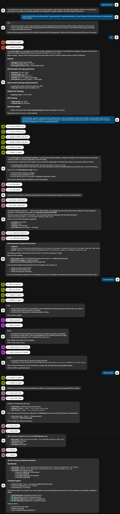

This example demonstrates how to fine‑tune a DPA‑2 force field for
diamond silicon (Si) using the PFD workflow.

**Workflow overview**

1. The MatCreator root agent transfers control to the PFD coordinator
	agent, which orchestrates the entire process.
2. The workflow combines MD exploration (DPA agent), data selection
	(PFD coordinator), DFT calculations with ABACUS (ABACUS agent), and
	DPA model training (DPA agent).
3. The PFD coordinator creates a unique log for each PFD workflow run,
	improving robustness and enabling restart from checkpoints.

