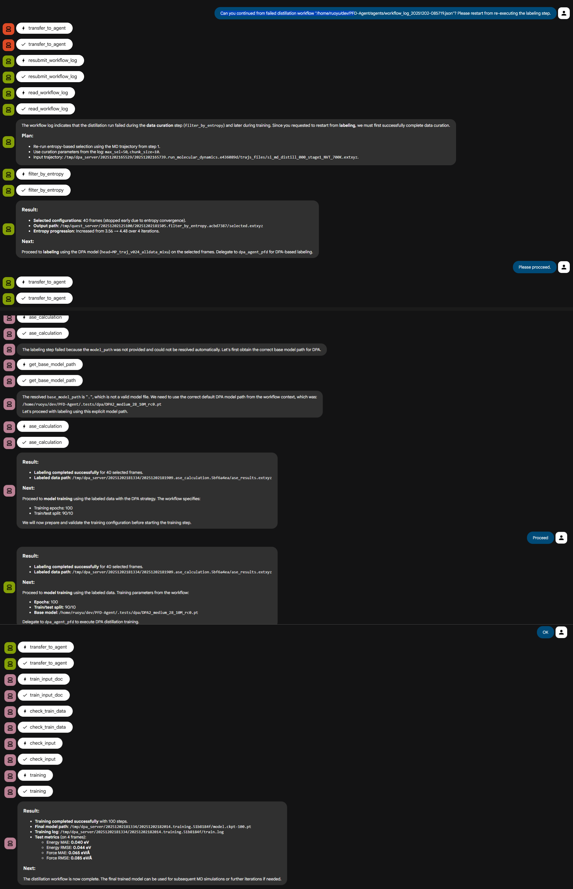

This example demonstrates how to resubmit a distillation workflow, which trains a small DPA force field for diamond silicon (Si) from pre-trained DPA-2 model using the PFD workflow.

**Workflow overview**

1. The MatCreator root agent read the failed workflow log, and restart from labeling.
2. The workflow continues distillation process and train the DPA model with synthetic data.

