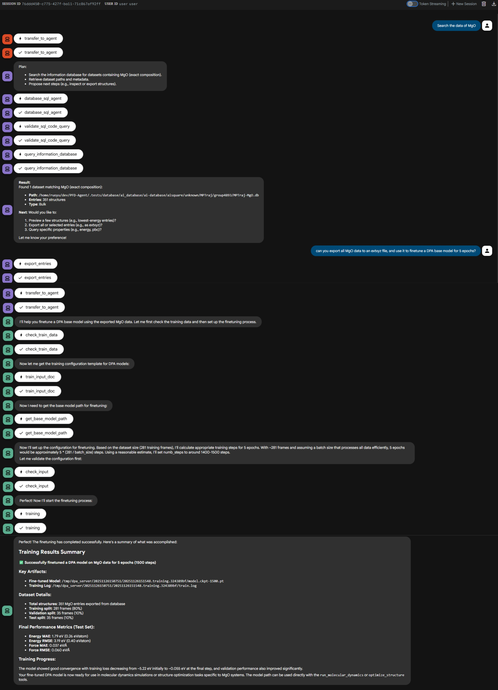

This example demonstrates how to fine‑tune a DPA‑2 force field for
magnesium oxide (MgO) using existing database entries.

**Workflow overview**

1. The MatCreator root agent transfers control to the database agent and
	queries the information database for MgO datasets.
2. The database agent extracts the selected MgO structures and then
	hands control over to the DPA agent.
3. The DPA agent fine‑tunes a DPA‑2 pre‑trained model on the extracted
	MgO data and monitors the training process.

